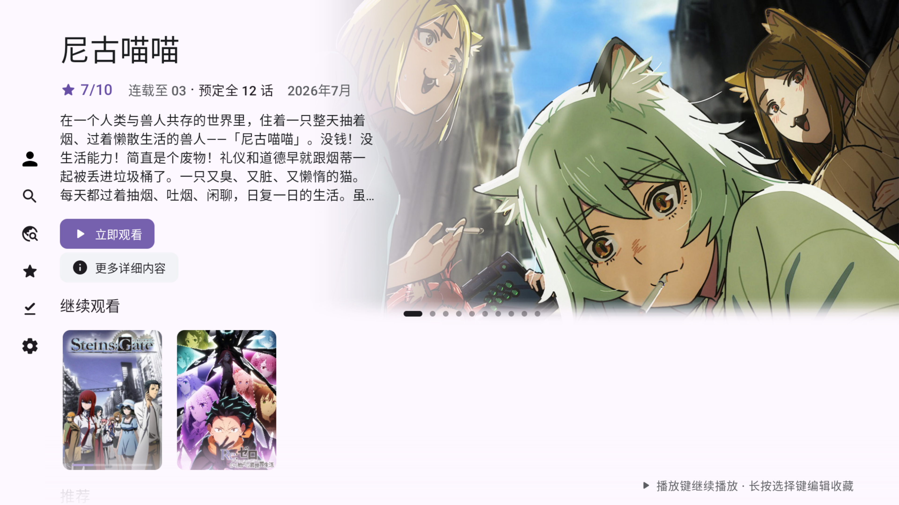
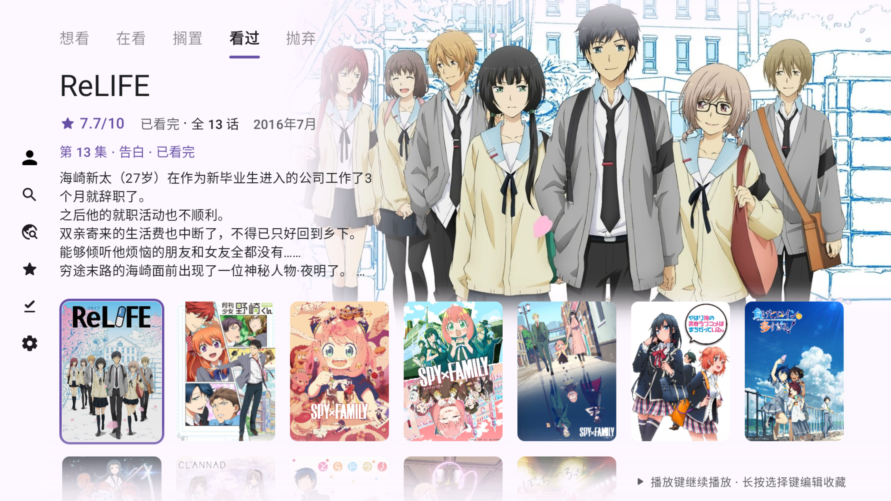
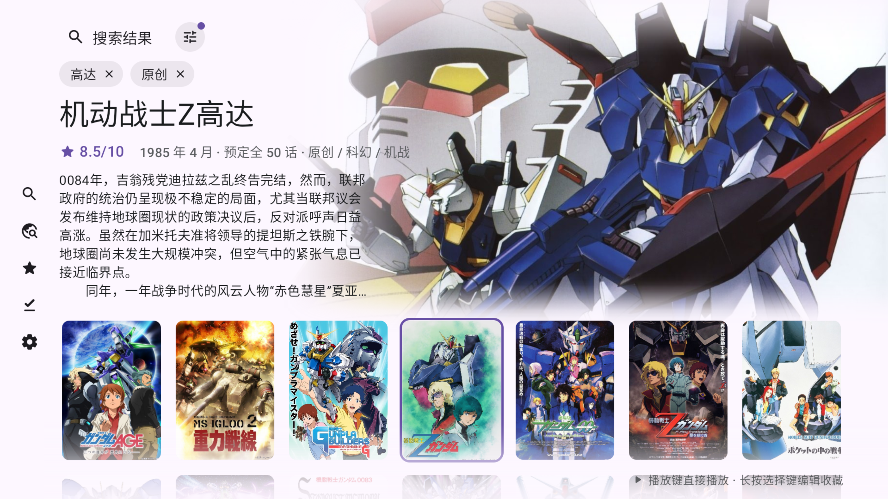
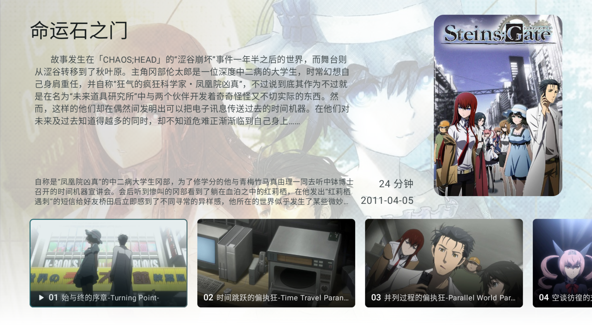

# Izuko TV

**为 Android TV / Google TV 遥控器打造的追番客户端**

| 下载 | 讨论群 | 许可证 | 原项目 |
|:---:|:---:|:---:|:---:|
|  |  |  |  |

> [!NOTE]
> Izuko TV 是 [Animeko](https://github.com/open-ani/animeko)（by OpenAni and contributors）的**第三方修改版**，依照 [AGPL-3.0](LICENSE.txt) 发布。
> 它重做了核心页面以适配电视遥控器，并改为直接连接 [Bangumi][Bangumi]，不再依赖 Animeko 服务器。
> 本项目与 OpenAni 团队**没有隶属关系，也未获其认可**；使用中遇到的问题请在[本仓库](https://github.com/GrahamZen/izuko-tv/issues)反馈，不要打扰上游。

[dmhy]: http://www.dmhy.org/

[Bangumi]: http://bangumi.tv

[ddplay]: https://www.dandanplay.com/

[Compose Multiplatform]: https://www.jetbrains.com/compose-multiplatform/

[acg.rip]: https://acg.rip

[Mikan]: https://mikanani.me/

[Ikaros]: https://ikaros.run/

[Kotlin Multiplatform]: https://kotlinlang.org/docs/multiplatform.html

[ExoPlayer]: https://developer.android.com/media/media3/exoplayer

[VLC]: https://www.videolan.org/vlc/

[libtorrent]: https://libtorrent.org/

Izuko TV 支持云同步观看记录 ([Bangumi][Bangumi])、多视频数据源、缓存、弹幕、以及更多功能，让你在电视上用遥控器舒服地追番。

[立即下载](https://github.com/GrahamZen/izuko-tv/releases/latest)

https://github.com/user-attachments/assets/e63636c9-30b7-411c-aa6b-e5b78b900726

## 主要功能

浏览 [Bangumi][Bangumi] 番剧信息与社区评价、新番时间表与标签搜索、云同步追番进度、聚合视频与弹幕数据源、离线缓存。这些通用功能来自上游 Animeko，完整介绍与截图见[上游仓库](https://github.com/open-ani/animeko#主要功能)。

与上游的主要区别：

- 界面按电视遥控器重做（见下方说明）；
- 番剧信息、收藏与进度直接读写 Bangumi，不经过 Animeko 服务器；
- 因此没有 Animeko 服务器提供的功能：Animeko 弹幕池、一起看、跨设备播放进度同步、举报评论、众包的片头片尾时间点；发弹幕改走 dandanplay 开放弹幕网络，评论直接发到 Bangumi。

## 📺 Android TV 版说明

Izuko TV 在上游基础上重做了核心页面以适配 Android TV。安装后在更新 release 之后会在主页提醒，在设置里可以直接更新。电视上界面偏大或偏小时，设置 → 界面的第一项**「界面缩放」**可在 50% ~ 250% （退出设置页时会重新启动一次界面）。 探索页、详情页与新番时间表可以在设置 → 主题与色彩里单独切回上游原布局（低端机可关）：

### 探索页
|  |
|:---------------------------------------------------------------------------------------------------:|

|  |
|:---------------------------------------------------------------------------------------------------:|

|  |
|:---------------------------------------------------------------------------------------------------:|

### 追番页

|  |
|:---------------------------------------------------------------------------------------------------:|

### 搜索页

|  |
|:---------------------------------------------------------------------------------------------------:|

### 详情页

|  |
|:--------------------------------------------------------------------------------------:|

|  |
|:---------------------------------------------------------------------------------------------------:|

|  |
|:---------------------------------------------------------------------------------------------------:|

### 播放器

https://github.com/user-attachments/assets/7f9fe051-a904-4157-a317-b13284390fec

### 系统级功能

- **主屏预览频道**：电视主屏幕显示"热门动画"频道和"继续观看"行，点击卡片直达详情页（首次启动时按系统提示允许添加频道）。

|  |
|:----------------------------------------------------------------------------------------------:|

- **屏保**：轮播在看与热门动画的横版剧照，按确定键直达该动画详情页，左右键切换（需在系统设置 → 屏保中选择 Izuko TV）。

|  |
|:------------------------------------------------------------------------------------:|

### 下载

| 平台          | 下载                                                                                        |
|-------------|-------------------------------------------------------------------------------------------|
| Android / 电视 | [前往 Releases 下载最新版 APK](https://github.com/GrahamZen/izuko-tv/releases/latest) |

> Release 里按架构分包：几乎所有电视与电视盒子选 `arm64-v8a`，旧盒子选 `armeabi-v7a`，模拟器与 x86 盒子选 `x86_64`——体积更小、更省存储。不确定或装不上时再用 `universal`（包含全部架构，体积最大）。同一个 APK 同时适用于手机、平板和电视盒子。

### ⚠️ 系统版本要求

- **正式包最低 Android 8.1（API 27）**，更低的系统无法安装（报 `INSTALL_FAILED_OLDER_SDK`）。
- **Android 7.1（API 25）** 请下载文件名带 `legacy` 的兼容包（每个 Release 都附带）。功能与正式包一致，但只在少量设备上验证过；7.1 上 BT 引擎跑在应用进程内，退到后台被系统回收后下载不会保活。
- Android 7.1 ~ 10 能装上，但未经实机验证，遥控器焦点行为可能有问题。遇到遥控器无法操作时请先确认系统版本，并欢迎反馈。

### 遥控器使用说明

#### 动作面板

**长按返回键**或**长按播放键**都会弹出同一个动作面板（播放页与登录、向导这类流程页除外，那里两个键保持原本的功能）。

#### 后台播放

退出播放页默认**播放移到后台**（设置 → 播放器和弹幕过滤里可关），后台加载完成的话会有气泡提示及音效。动作面板可以看到状态以及控制后台播放。

#### 播放器

播放器分三层，**返回键逐层往回**：纯视频 → 控制层（进度条与下方按钮行）→ 面板 / 侧边栏（数据源、选集、弹幕设置）；**长按返回**可以从任意一层直接回到播放画面。

画面上什么都没有时（纯视频）：

| 按键              | 效果                                                            |
|-----------------|---------------------------------------------------------------|
| 上 / 下键          | 唤出控制层，焦点落在进度条上                                                |
| 确认键（短按）         | 播放 / 暂停（暂停时顺带唤出控制层）                                           |
| 确认键（按住）         | 长按倍速，松手还原（倍率取设置里的「长按倍速倍率」，默认 2.5x）                            |
| 左 / 右键（单按）      | 快退 / 快进 5 秒，中央给一次图标反馈，不唤出控制层                                  |
| 左 / 右键（连按或按住）   | 进入拖动预览：出进度条与缩略图，越按越快；确认键跳到圆点处继续播放，返回键取消                       |
| 播放 / 暂停键        | 播放 / 暂停                                                       |
| 快进 / 快退键        | 下一集 / 上一集                                                     |

控制层里方向键就是普通的焦点移动（进度条、胶囊行、图标行、选集条之间）。

#### 焦点与列表操作

焦点丢失不用手动找回：每个页面都记着上次聚焦的那张卡 / 那颗按钮，焦点悬空时会自动落回去。

设置 → 数据源管理支持纯遥控器排序：在某一行上**长按确认键**直接进入多选模式并选中该行（也可以按行末的「⋮」→「多选」）→ 在多选模式里**长按**任意一行出批量菜单 → 选「排序」把这一行拿起来，上下键移动它，确认键或返回键放下即保存。多选模式下按返回键退出多选。

> 最开始的登录部分如果焦点丢失，请接入鼠标完成登录，之后即可继续使用遥控器。

### 手动完成验证码页面的操作

| 操作              | 效果                                  |
|-----------------|-------------------------------------|
| 方向键             | 移动光标（先按一下方向键唤出光标）          |
| 确认键（短按）        | 在光标位置模拟触摸点击（用于通过验证码）      |
| 确认键（长按 ~500ms） | 点击"✓"（大部分情况通过验证码后会自动关闭）  |
| 返回键             | 取消，关闭对话框                          |

### 已知问题

- Android 8.1 ~ 10 未经实机验证，遥控器焦点行为可能有问题（见上方系统版本要求）。

## 其他平台

Izuko TV 只发布 Android 包（电视与电视盒子为主，手机、平板也能装）。Windows、macOS、Linux、iOS 请使用[上游 Animeko](https://github.com/open-ani/animeko)。

## 技术总览

如果你是开发者，欢迎提交 PR！以下几点可以给你一个技术上的大概了解。

- [Kotlin 多平台][Kotlin Multiplatform]架构，UI 使用 [Compose Multiplatform][Compose Multiplatform]；
- 电视界面在独立的 `app/shared/ui-tv` 模块，手机 / 桌面代码不受影响；
- 上游打造的基于 [libtorrent][libtorrent] 的 BitTorrent 引擎，优化边下边播；
- 多平台[视频播放器](https://github.com/open-ani/mediamp)，Android 底层为 [ExoPlayer][ExoPlayer]；
- 多类型数据源适配，内置 [动漫花园][dmhy]、[Mikan]，支持自定义数据源与自动选源。

### 参与开发

项目技术细节请参考 [CONTRIBUTING](docs/contributing/README.md)，与上游的差异见 [FORK.md](FORK.md)。

## FAQ

### 资源来源是什么?

全部视频数据都来自网络，Izuko TV 本身不存储、也不提供任何视频资源。
支持两大数据源类型：BT 和在线。BT 源即为公共 BitTorrent P2P 网络，每个在 BT 网络上的人都可分享自己拥有的资源供他人下载；
在线源即为其他视频资源网站分享的内容，默认订阅 [creamycake ani-subs](https://github.com/creamycake-anime/ani-subs)，也可以自行添加。

本着互助精神，使用 BT 源时 Izuko TV 会自动做种 (分享数据)。

### 弹幕来源是什么?

弹幕来自[弹弹play][ddplay]，弹弹play 还会从其他弹幕平台例如哔哩哔哩港澳台和巴哈姆特获取弹幕。
Izuko TV 不连接 Animeko 的弹幕服务器，所以不能发送弹幕。

## 许可证与致谢

Izuko TV 基于 [open-ani/animeko](https://github.com/open-ani/animeko) 修改而来，以 [GNU Affero General Public License v3.0](LICENSE.txt) 发布，与上游相同。

- 源代码中原有的版权声明（Copyright (C) OpenAni and contributors）均予保留；
- 相对上游的修改记录在本仓库的提交历史与 [FORK.md](FORK.md) 中，完整源代码即本仓库；
- 「Animeko」名称与图标归 OpenAni 所有，Izuko TV 使用自己的名称与图标，不代表上游。

感谢 OpenAni 团队与所有 Animeko 贡献者。
