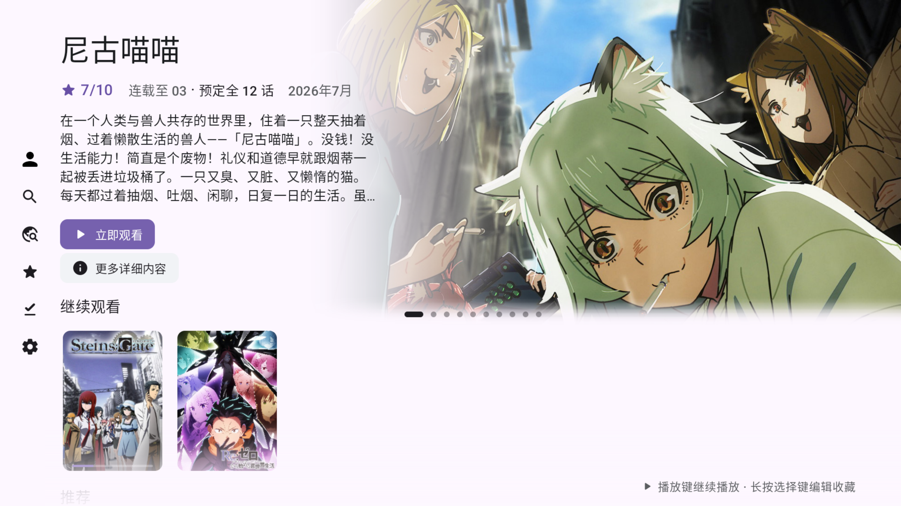
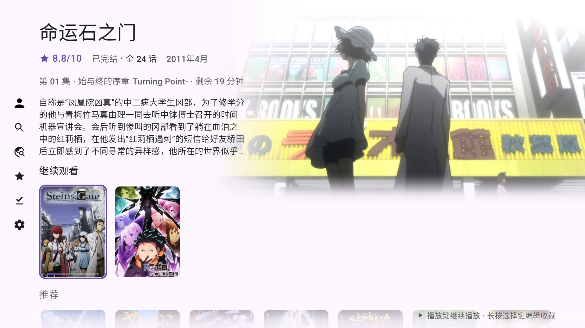
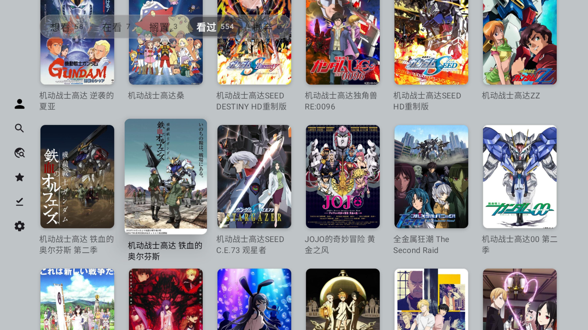
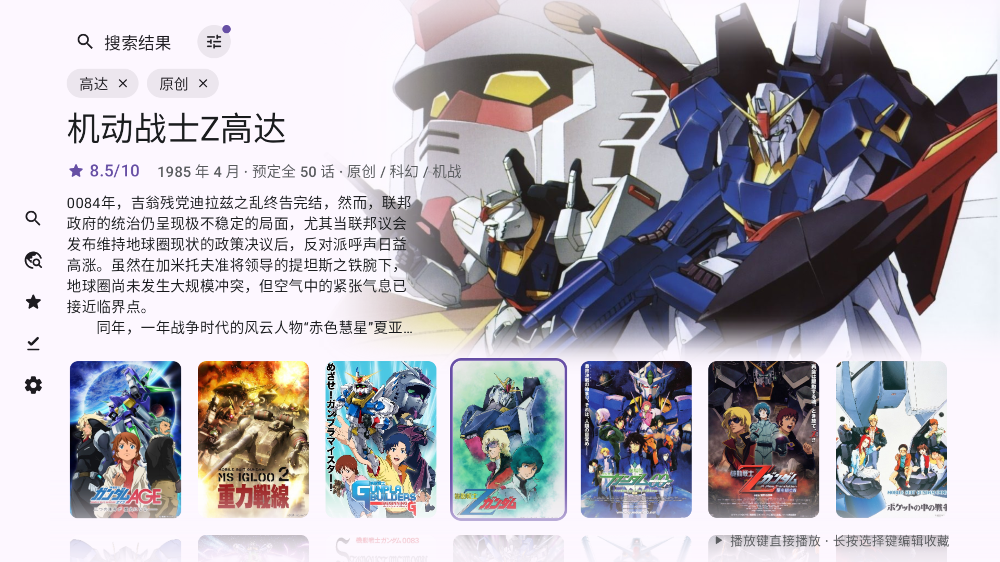
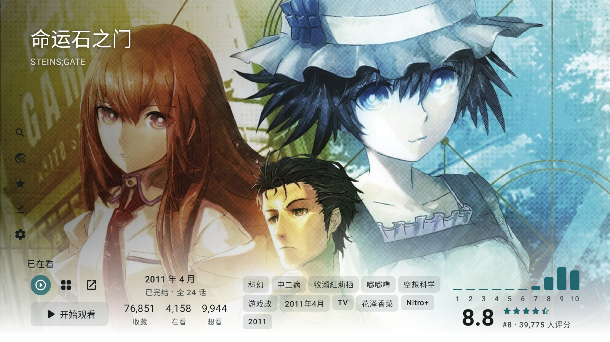
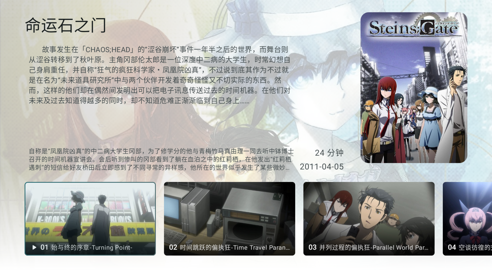
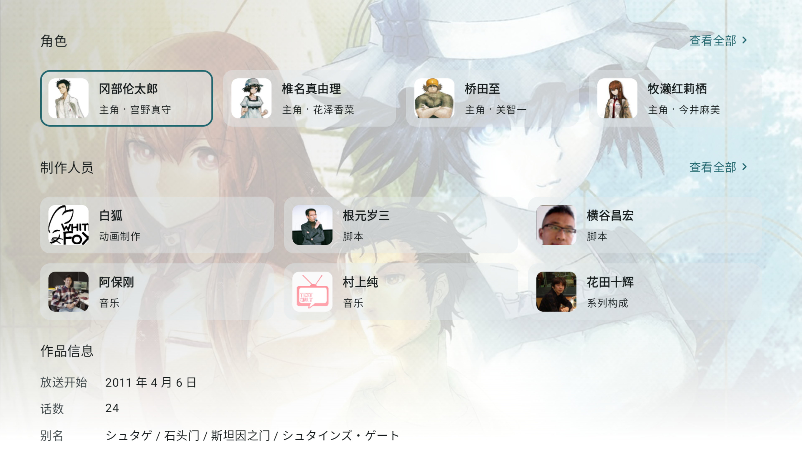
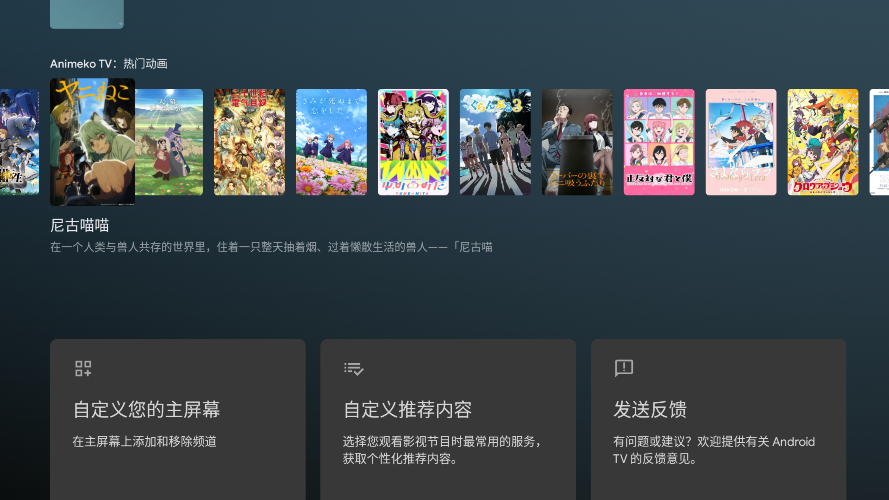

# Izuko TV

**为 Android TV / Google TV 打造的追番客户端**

| 下载 | 讨论群 | 许可证 | 原项目 |
|:---:|:---:|:---:|:---:|
|  |  |  |  |

> [!NOTE]
> Izuko TV 是 [Animeko](https://github.com/open-ani/animeko)（by OpenAni and contributors）的**第三方修改版**，依照 [AGPL-3.0](LICENSE.txt) 发布。它为电视重新设计了界面，并直接连接 [Bangumi][Bangumi]，不依赖 Animeko 服务器。
> 本项目与 OpenAni 团队**没有隶属关系，也未获其认可**；使用中遇到的问题请在[本仓库](https://github.com/GrahamZen/izuko-tv/issues)反馈，不要打扰上游。

[立即下载](https://github.com/GrahamZen/izuko-tv/releases/latest)

## 功能

- **Bangumi 同步**：番剧信息与评论，收藏、评分和观看进度直接读写你的 Bangumi 账号
- **多数据源**：BT（[动漫花园][dmhy]、[Mikan]）与在线源，支持订阅和自定义，自动选源
- **弹幕**：来自[弹弹play][ddplay]，也可以发送
- **离线缓存**：提前把剧集缓存到本地；BT 资源边下边播
- **播放器**：拖动进度时预览画面，长按倍速，片尾自动接下一集
- **找番**：首页按你的收藏推荐，另有新番时间表和按标签、年份的搜索
- **手机操作**：扫电视上的二维码打开 Web 控制台，不用装应用，在手机上打字搜索、登录、控制播放、管理缓存和设置
- **系统集成**：主屏幕频道、屏保、应用内更新
- **网络检测**：首次打开时检测能否连上 Bangumi，连不上可以改用代理或社区镜像

## 界面预览

### 探索页

|  |
|:---------------------------------------------------------------------------------------------------:|

|  |
|:---------------------------------------------------------------------------------------------------:|

|  |
|:---------------------------------------------------------------------------------------------------:|

### 追番页

|  |
|:---------------------------------------------------------------------------------------------------:|

### 搜索页

|  |
|:---------------------------------------------------------------------------------------------------:|

### 详情页

|  |
|:--------------------------------------------------------------------------------------:|

|  |
|:---------------------------------------------------------------------------------------------------:|

|  |
|:---------------------------------------------------------------------------------------------------:|

### 播放器

https://github.com/user-attachments/assets/7f9fe051-a904-4157-a317-b13284390fec

### 主屏幕频道与屏保

主屏幕上显示「热门动画」频道和「继续观看」行，点卡片直达详情页（首次启动时按系统提示允许添加频道）。

|  |
|:----------------------------------------------------------------------------------------------:|

屏保轮播在看和热门动画的剧照，按确认键进入详情页，左右键切换（在系统设置 → 屏保中选择 Izuko TV）。

|  |
|:------------------------------------------------------------------------------------:|

## 下载安装

在 [Releases](https://github.com/GrahamZen/izuko-tv/releases/latest) 下载 APK，装到电视或电视盒子上（手机、平板也能装）。

- **选哪个包**：默认下 `universal`（包含全部架构）。确切知道设备系统架构的，可以直接下对应的分架构包，体积更小。
- **装不上**：个别盒子会拒装 `universal`（如腾讯极光盒子 7S），这时改下 `armeabi-v7a`，还不行再试 `arm64-v8a`。设备信息里显示 64 位，不代表能装 64 位的包：不少电视和盒子的系统是 32 位的，装 `arm64-v8a` 会失败。
- **系统要求**：Android 8.1 及以上。Android 7.1 请下文件名带 `legacy` 的兼容包（同样优先选 `legacy-universal`），7.1 上应用退到后台后 BT 下载可能被系统停掉。Android 10 及以下测试得较少，遇到问题欢迎反馈。
- **更新**：有新版本时首页会提示，在「设置 → 软件更新」里可以直接更新。

Windows、macOS、Linux 和 iOS 请使用[上游 Animeko](https://github.com/open-ani/animeko)。

## 使用说明

基本操作和其他电视应用一样。在播放器以外**长按返回键**或**长按播放键**会打开动作面板：回到正在播放的那一集或接着看上次的，也能回首页、刷新、换一批推荐、退出，右上角是 Web 控制台的二维码（长按的作用可以在「设置 → 界面」里改）。

### 播放器

| 按键 | 作用 |
|:--|:--|
| 确认 / 播放暂停键 | 播放、暂停 |
| 按住确认键 | 倍速播放，松开恢复（默认 2.5 倍） |
| 左 / 右 | 快退、快进 5 秒 |
| 按住或连按左 / 右 | 拖动进度并预览画面，确认键跳转，返回键取消 |
| 上 / 下 | 显示进度条和控制按钮 |
| 快进 / 快退键 | 下一集、上一集 |
| 返回 | 逐层收起面板和控制按钮，最后退出播放 |
| 长按返回 | 直接收起所有面板，回到画面 |

控制按钮显示时，方向键用来在按钮之间移动。

退出播放页后，这一集会保留在后台，能播放时有气泡提示，回来不用重新找源；不需要的话在「设置 → 播放器和弹幕过滤」里关闭。

### 小提示

- **界面太大或太小**：「设置 → 界面 → 界面缩放」可以在 50% ~ 250% 之间调整。
- **设备较卡**：「设置 → 主题与色彩 → 视觉效果」选「流畅」；探索页、详情页和新番时间表也可以分别关掉沉浸式布局。
- **电视上登录不方便**：扫登录页上的二维码，在手机上登录。
- **数据源排序**：在「设置 → 数据源管理」长按一行进入多选，再长按任意一行选「排序」，上下键移动，确认键放下。
- **网页验证码**（部分在线数据源需要）：先按方向键唤出光标，确认键点击；验证通过后一般会自动关闭，没关就长按确认键。

## 常见问题

### 和 Animeko 有什么区别？

界面为电视重新设计；番剧信息、收藏和观看进度直接读写 Bangumi，不经过 Animeko 服务器。因此依赖这个服务器的功能都没有：Animeko 弹幕池、一起看、跨设备同步播放进度、举报评论、众包的片头片尾时间点。Bangumi 上的评论可以看，发表可以使用控制台跳转到对应的 Bangumi 网页完成。

### 视频从哪里来？

全部视频数据都来自网络，Izuko TV 本身不存储、也不提供任何视频资源。数据源分 BT 和在线两类：BT 源来自公共 BitTorrent 网络，每个人都可以分享自己拥有的资源；在线源来自其他视频网站，默认订阅 [creamycake ani-subs](https://github.com/creamycake-anime/ani-subs)，也可以自行添加。

本着互助精神，使用 BT 源时 Izuko TV 会自动做种（分享数据）。

### 弹幕从哪里来？

弹幕来自[弹弹play][ddplay]，其中包括它从哔哩哔哩港澳台、巴哈姆特等平台获取的弹幕。在 Izuko TV 里发送的弹幕也发到弹弹play。

## 参与开发

欢迎提交 PR。

- [Kotlin 多平台][Kotlin Multiplatform]架构，界面使用 [Compose Multiplatform][Compose Multiplatform]；电视界面在独立的 `app/shared/ui-tv` 模块
- 沿用上游基于 [libtorrent][libtorrent] 的 BT 引擎（为边下边播优化）和[多平台播放器](https://github.com/open-ani/mediamp)（Android 底层为 [ExoPlayer][ExoPlayer]）

开发说明见 [CONTRIBUTING](docs/contributing/README.md)，与上游的差异见 [FORK.md](FORK.md)。

## 许可证与致谢

Izuko TV 基于 [open-ani/animeko](https://github.com/open-ani/animeko) 修改而来，以 [GNU Affero General Public License v3.0](LICENSE.txt) 发布，与上游相同。

- 源代码中原有的版权声明（Copyright (C) OpenAni and contributors）均予保留；
- 相对上游的修改记录在本仓库的提交历史与 [FORK.md](FORK.md) 中，完整源代码即本仓库；
- 「Animeko」名称与图标归 OpenAni 所有，Izuko TV 使用自己的名称与图标，不代表上游。

感谢 OpenAni 团队与所有 Animeko 贡献者。

[Bangumi]: http://bangumi.tv

[dmhy]: http://www.dmhy.org/

[Mikan]: https://mikanani.me/

[ddplay]: https://www.dandanplay.com/

[Kotlin Multiplatform]: https://kotlinlang.org/docs/multiplatform.html

[Compose Multiplatform]: https://www.jetbrains.com/compose-multiplatform/

[libtorrent]: https://libtorrent.org/

[ExoPlayer]: https://developer.android.com/media/media3/exoplayer
